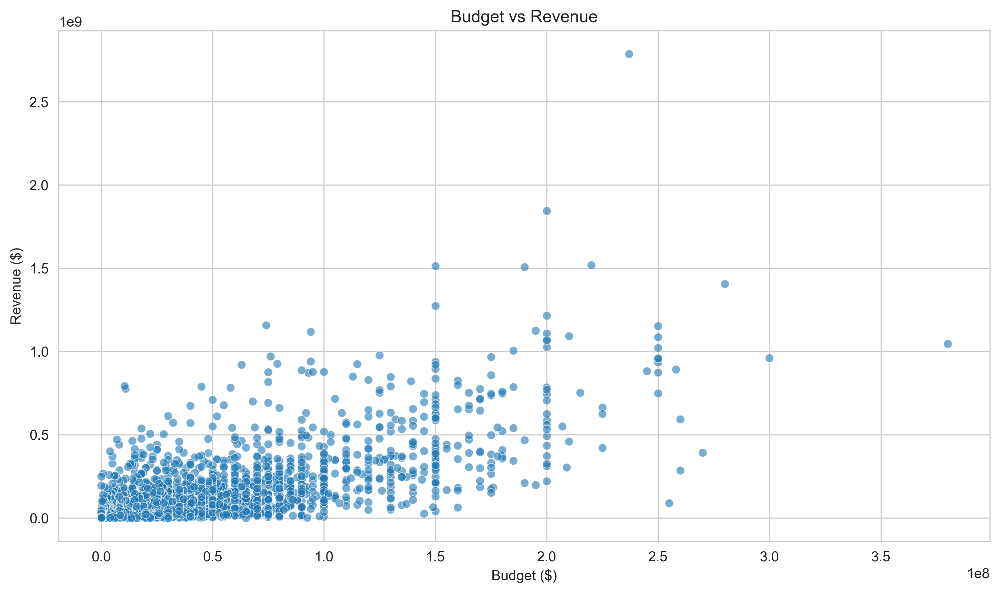
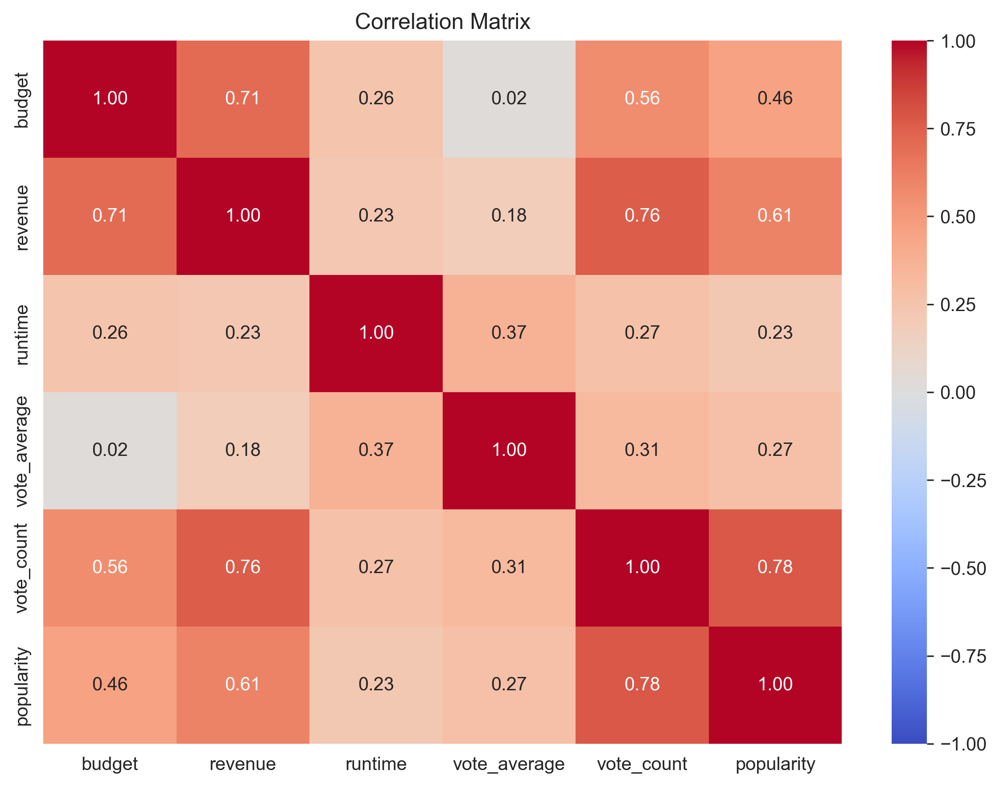
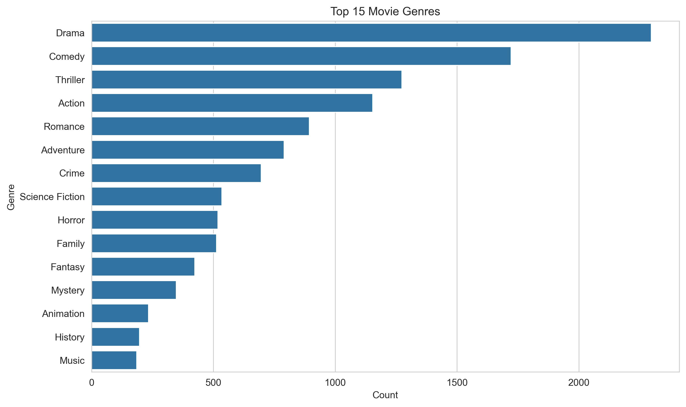
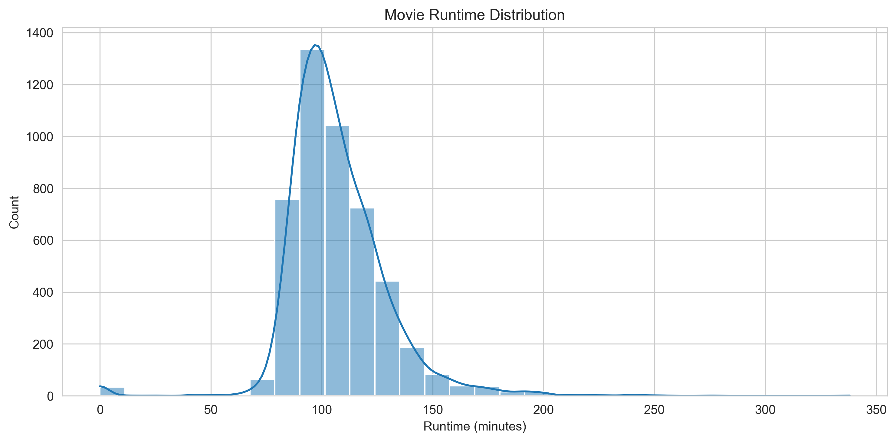
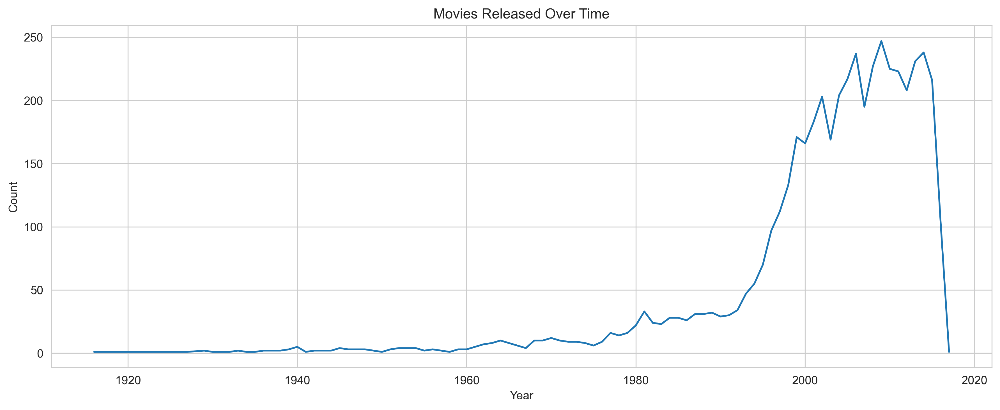

# Project 3: TMDB Movies – Exploratory Data Analysis (EDA)

## Problem Statement
What factors drive box office success for movies? This project explores 4,800+ TMDB movies to identify measurable drivers of revenue and popularity using real-world metadata.

## Objectives
- Clean and prepare TMDB movie metadata for analysis
- Explore relationships between budget, revenue, runtime, vote metrics, and popularity
- Identify genre trends and release patterns over time
- Present data-backed findings with publication-quality visuals

## Dataset
[TMDB 5000 Movie Dataset](https://www.kaggle.com/datasets/tmdb/tmdb-movie-metadata) – Contains 4,803 movies with budget, revenue, genres (JSON), runtime, vote_average, vote_count, popularity, release_date, production details.

## Methodology
1. **Data Inspection** – Checked types, nulls, distributions
2. **Cleaning** – Converted `release_date` to datetime, extracted `release_year`, treated zero budgets/revenues as missing (to avoid skew), filled `runtime` with median
3. **Feature Engineering** – Parsed JSON `genres` into list for frequency analysis
4. **EDA** – Univariate, bivariate (scatter/corr), trend analysis
5. **Visualization** – Matplotlib/Seaborn with saved exports for portfolio

## Key Findings (Data-Driven)

- **Budget → Revenue (Strong Positive Correlation)**: `budget` and `revenue` show **r ≈ 0.73** (moderate–strong). Higher production budgets tend to be associated with higher box office revenue (not guaranteed, but a clear directional trend).
- **Engagement Drives Popularity**: `vote_count` correlates strongly with `popularity` (audience engagement matters more than a single high rating in many cases).
- **Genre Distribution**: Drama, Comedy, Thriller, Action, and Romance are the most frequent genres in the dataset—useful for understanding market coverage.
- **Runtime Sweet Spot**: Movie runtimes cluster around **90–120 minutes**, with a right-skewed distribution.
- **Production Growth**: Release volume shows a clear upward trend over recent decades, peaking in mid-late 2010s.
- **Outliers Exist**: Several high-budget blockbusters drive the upper tail (visible in scatterplots)—important to note when interpreting averages.

## Visual Results

| Visual | Insight |
|---|---|
|  | Strong positive linear relationship between budget & revenue (log-scale intuition visible). High-budget films dominate top earners. |
|  | Confirms budget–revenue (0.73), vote_count–popularity link, and weaker links for runtime/vote_average alone. |
|  | Drama leads by frequency, followed by Comedy/Thriller/Action—reflects catalog composition. |
|  | Bimodal-ish clustering around feature-length (90–120 min); typical theatrical range. |
|  | Long-term growth trend in movie production counts over time. |

## Reproducibility
- **Notebook:** [`movies_analysis.ipynb`](./movies_analysis.ipynb) (executed: [`movies_analysis_executed.ipynb`](./movies_analysis_executed.ipynb))
- **Run:** `jupyter nbconvert --execute movies_analysis.ipynb` (or open in Jupyter)
- **Exports:** All CSVs/PNGs in [`outputs/`](./outputs/)

## Tools
Python 3.11, Pandas, NumPy, Matplotlib, Seaborn, JSON, Jupyter

## Conclusion
This analysis provides **evidence-based** insight: budget is the strongest numeric predictor of revenue among core features (r≈0.73), while audience engagement (vote_count) better explains popularity than average rating alone. Genre and runtime patterns align with industry norms. These are **real, interpretable findings**—not just code execution.